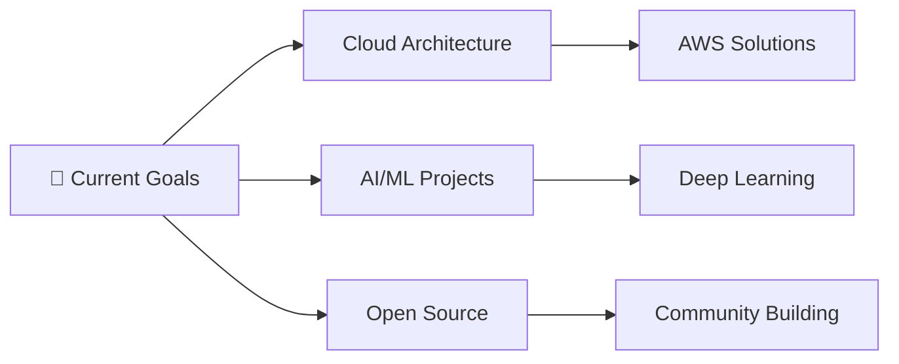

  

  

---

## 🚀 About Me

I'm a passionate developer who loves creating innovative solutions and exploring new technologies. I believe in writing clean, efficient code and continuously learning to stay at the forefront of technology.

- 🔭 **Currently working on:** Full-stack development projects
- 🌱 **Currently learning:** Advanced cloud architectures and AI/ML
- 👯 **Looking to collaborate on:** Open source projects and innovative startups
- 💬 **Ask me about:** Web development, software architecture, and tech trends
- 📫 **How to reach me:** Through my social links below
- ⚡ **Fun fact:** I debug with coffee and deploy with confidence!

---

## 🛠️ Tech Stack

### Languages

### Frontend

### Backend & Database

### Cloud & DevOps

---

## 📊 GitHub Stats

  
  

  

---

## 🎯 Current Focus

```mermaid
graph LR
    A[🎯 Current Goals] --> B[Cloud Architecture]
    A --> C[AI/ML Projects]
    A --> D[Open Source]
    B --> E[AWS Solutions]
    C --> F[Deep Learning]
    D --> G[Community Building]
```

- 🌟 Building scalable cloud-native applications
- 🤖 Exploring AI/ML integration in web applications
- 🚀 Contributing to open source projects
- 📚 Mentoring aspiring developers

---

## 🌐 Let's Connect

---

  

  

---

  <i>⭐️ From [alira-xk](https://github.com/alira-xk) with ❤️</i>

